==================================================

.. contents:: Table of Contents

Objective
####################
Use this guide and the provided sample app, included scripts and utility app to explore the **Secure Multicloud Networking (MCN)** use-cases of the F5 Distributed Cloud Platform. This will help you get familiar with the following features & capabilities: 

- MCN Cloud-to-Cloud via HTTP Load Balancer (Layer 7);
- MCN Cloud-to-Cloud via Global Network (Layer 3);
- Analytics, Observability.

Each of the modules in this guide addresses a specific use-case with a help of included Terraform scripts. With Terraform scripts you can simplify the deployment of a sample app components in multiple cloud environments,

The included link to a utility service provides some helpful tools to assist with both configuration and testing of the environments:

- Generate a domain and configure DNS records for it based on F5 Distributed Cloud Services CNAME and other specific parameters

Resources 
#########

For more information covered by this Demo Guide, please see the following resources including DevCentral article(s), YouTube video(s) and automation scripts based on Terraform:

- DevCentral Articles: 

  - `Outlining Multi-Cloud Networking with F5 Distributed Cloud Services <https://community.f5.com/t5/technical-articles/demo-guide-multi-cloud-networking-with-f5-distributed-cloud/ta-p/317523>`_ 

  - `Overviewing the key networking use cases for F5 Distributed Cloud <https://community.f5.com/t5/technical-articles/demo-guide-amp-video-series-for-f5-distributed-cloud-network/ta-p/309875>`_

  - `Using F5 Distributed Cloud to connect apps running in multiple clusters and sites <https://community.f5.com/t5/technical-articles/use-f5-distributed-cloud-to-connect-apps-running-in-multiple/ta-p/298357>`_

- `YouTube video series discussing the different aspects of this configuration in each cloud location <https://www.youtube.com/watch?v=7vTGdjmMZP8&t=42s>`_

- `A set of Terraform scripts <https://github.com/f5devcentral/xcmcndemoguide/tree/main/terraform>`_

Public Cloud (Multicloud), Modules & Scripts
##############################################

The contents of the guide is divided into modules, which can be used separately or together in order to explore a particular Multicloud Networking use-case. Each module contains a set of `Terraform scripts <./terraform>`_ for different public clouds (rev. 1: Amazon AWS and Microsoft Azure, rev.2: adds Google GCP). 

These modules are intended to simplify deployment of sample app services in three different clouds: Cloud A, Cloud B, and Cloud C in order to work through different MCN use-cases. Here's a recommended selection of cloud providers for this guide, which will be used as a reference throughout:

- Cloud A: AWS

- Cloud B: Azure - VNET1

- Cloud C: Azure - VNET2

Note that at a minimum only one public cloud is required (see Requirements), in which case you'd need to deploy app components in different virtual private clouds (VPCs) on AWS or VNETs on Azure.

- Cloud A: AWS VPC 1 (or Azure VNET 1)

- Cloud B: AWS VPC 2 (or Azure VNET 2) - simulating multi-cloud  

- Cloud C: AWS VPC 3 (or Azure VNET 3) - simulating multi-cloud 

However, if possible, it's recommended to have access to at least two public clouds for the most representative MCN experience. 

Pre-requisites
#################

- F5 Distributed Cloud Console account (trial is sufficient for most modules)
- A Web browser to access the Console
- Terraform installed and configured (Linux preferred)

Scenario
####################

F5 Secure Multicloud Networking is a complete multi-cloud networking solution to deploy distributed applications across clouds and edge sites. This demo is intended to be self-sufficient as a quick way to familiarize with some of the main MCN use-cases supported by the Distributed Cloud Platform. We’ll use a representative customer app scenario with multiple app services distributed across different clouds: a fictitious Arcadia Finance app which is representative of a typical banking website with features such as customer login, statements, and bank transfers. This customer is looking to add to its website additional banking services, such as a Refer-a-Friend Widget and a Transactions Module, which are developed and managed by other teams, and are deployed/running on public cloud infrastructure other than the core banking app. 

The initial state of the Arcadia Finance website features several "Coming Soon" placeholders for the additional banking services which will "come online" as soon as the networking is properly configured. We will use F5 Secure Multicloud Networking solution to quickly connect these new services into the core banking module by way of F5 MCN features. Once properly networked, these features will be turned.

.. figure:: assets/mcn-overview.gif

Module Overview
################

Module 1: Front-end Portal deployed in Cloud A
**********************************************

In this module we will deploy front-end portal in Cloud A, pick a public cloud with TF scripts for AWS (or Azure) and use F5 Distributed Cloud Services to configure HTTP LB for front-end. We will use a tool to generate a domain entry. This use case supposes SSL offloading, the process of removing the SSL-based encryption from incoming traffic to relieve a web server of the processing burden of decrypting and/or encrypting traffic sent via SSL.

.. figure:: assets/ssl-offload.png

Follow the `Terraform instructions <./terraform/cloud-a>`_ to get started with the environment config using your public cloud provider with Terraform.

Next, set up the HTTP Load Balancer. In the F5 Distributed Cloud Console navigate to the **Multi-Cloud App Connect** service in the service menu.

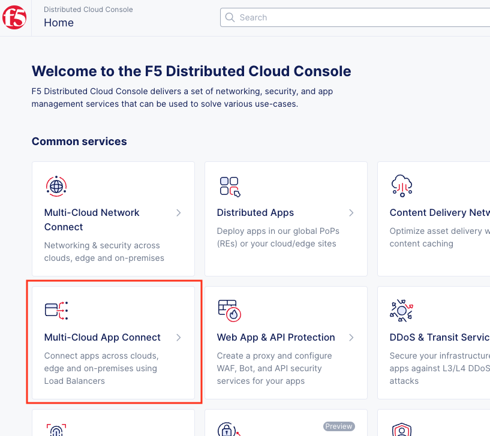

Navigate to **Load Balancers** and select **HTTP Load Balancers**. Then click the **Add HTTP Load Balancer** button to open the form of HTTP Load Balancer creation.

.. figure:: assets/create_cloud_a_lb.png

Give it a name. For this demo we will use **arcadia-finance**.

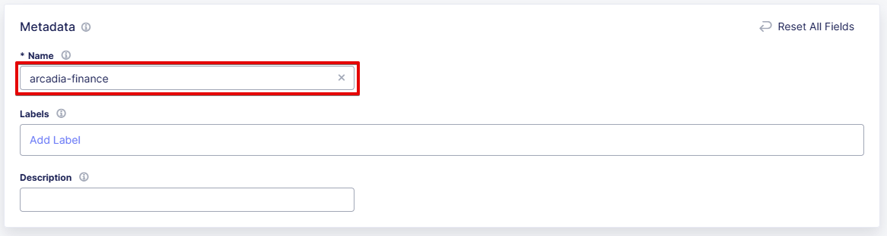

Next, we need to provide a domain name for our workload: a domain can be delegated to F5, so that Domain Name Service (DNS) entries can be created quickly in order to deploy and route traffic to our workload within seconds. In this demo we specify **yawning-white-antelope.github.securelab.online**.

Then check off the boxes to redirect HTTP to HTTPS, and add HSTS Header.

After that let's create a new origin pool, which will be used in our load balancer. The origin pools are a mechanism to configure a set of endpoints grouped together into a resource pool that is used in the load balancer configuration. Click **Add Item** to open the pool creation form.

.. figure:: assets/cloud_a_lb_origins.png

Then open the drop-down menu and click **Add Item**.

.. figure:: assets/cloud_a_lb_create_origin.png

To configure the origin pool we'll add a pool name, followed by a set of config options for the pool. First, let's give this pool a name. Next, we need to configure the port (the end point service/workload available on this port). In this demo it's Port **80**. And now click **Add Item** to start configuring an origin server.

.. figure:: assets/cloud_a_lb_origin_details.png

Let's now configure origin server. First open the drop-down menu to specify the type of origin server. For this demo select **IP address of Origin Server on given Sites**. Then specify IP - **10.0.20.100** for this demo. After that specify **cloud-a** as site. Finally, make sure **Inside Network** is selected. Complete by clicking **Apply**.

Then just click **Add Origin Pool** to move on.

Once done, click **Apply** to apply the origin pool to the load balancer configuration. This will return to the load balancer configuration form.

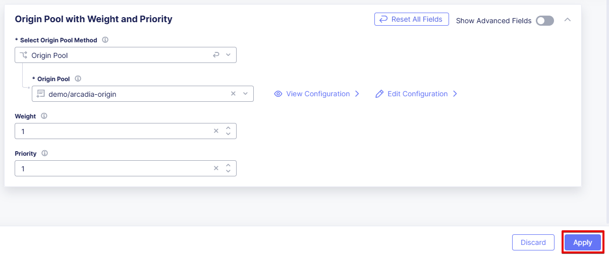

Take a look at the load balancer configuration and finish creating it by clicking **Add HTTP Load Balancer**.

.. figure:: assets/cloud_a_lb_save.png

You will see the created HTTP Load Balancer. Now we need to copy the host name in order to delegate the domain. Open the menu of HTTP Load Balancer we've just created and select **Manage Configuration**.  

Copy host name you see in the configuration. Host name will be used as CNAME value for the domain. After copying the host name, move on and copy CNAME value. It will be used to create an HTTPS certificate. 

.. figure:: assets/cloud_a_lb_dns_details.png

Open `Arcadia DNS Tool <https://tool.xc-mcn.securelab.online>`_ and paste the host name as **CNAME record** and the CNAME value as **ACME_CHALLENGE record**. Then click **Update** to update DNS and create the certificate. 

.. figure:: assets/cloud_a_lb_tool_update.png

It may take a few minutes to update the DNS info and generate and apply the certificate. You will see their updated status as below:

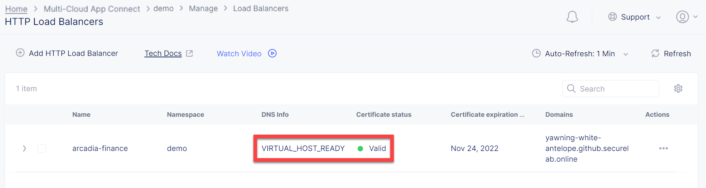

Now that the DNS is updated and the certificate is active, let's proceed to the website and test. Go to **yawning-white-antelope.github.securelab.online** and see if the certificate of the site is valid. Let's now log in. 

.. figure:: assets/cloud_a_lb_website.png

Fill in **admin** as username and **iloveblue** as its password. 

.. figure:: assets/cloud_a_lb_website_login.png

After we enter the website, we can see it's up and running. We can also see that there are a few modules that are still not active - Refer a friend and Transactions. We will configure them in the following steps.

.. figure:: assets/cloud_a_lb_website_sections.png

Next, let's navigate to **Applications** and proceed to the **Traffic Graph** to see the current traffic flow. It shows us traffic coming from clients to Cloud A through F5 Distributed Cloud PoP with SSL offloading which provides security and speed.  

And finally, let's take a look at the HTTP Load Balancer dashboard. Proceed to **Performance** and then click on the created HTTP LB. 

.. figure:: assets/app_traffic_2.png

We can see a view for entire performance monitoring information. Dashboard shows sections such as healthscore, active alerts, metrics, clients, devices, policy, security, etc. Metrics include requests, throughputs, and latency. Client information includes details such as top clients, TLS fingerprints, client location, etc.
Device information includes device type and browser type. 

################

Module 2: Back-end Service via HTTP LB (Layer 7) in Cloud B
***********************************************************

In this module we will connect the Refer-a-Friend Widget, which will be running in our Cloud B. We will create another HTTP Load Balancer (Layer 7), and make it available on the Arcadia Finance website, which was previously inactive in the step above. 

But first, we need to configure our second cloud (Cloud B) by following the `Terraform instructions <./terraform/cloud-b>`_, where again you can choose a cloud provider. 

If you have access to different cloud providers, it is recommended that for Cloud B you use a provider different from the one you've configured for Cloud A. In this guide, we will use Azure for Cloud B, since we already configured AWS for Cloud A. 

If you only have access to one provider, you can run the Terraform scripts for that same provider for `Cloud B <./terraform/cloud-b>`_, and the scripts will create a new independent AWS VPC or Azure Resource Group for the deployment of the Refer-a-Friend Widget. 

Below is the service topology we will achieve at the end of this module. Note the IP overlap of the Core Module IP (deployed in the previous step), and the IP of the Refer-a-Friend service (also 10.0.20.100). This is a perfect opportunity to use an HTTP Load Balancer!

.. figure:: assets/layer-7.png

Let's create one more HTTP Load Balancer for this use case. In the **Multi-Cloud App Connect** service navigate to **Load Balancers**. Proceed to the **HTTP Load Balancers** and click the **Add HTTP Load Balancer** button to open the form of HTTP Load Balancer creation.

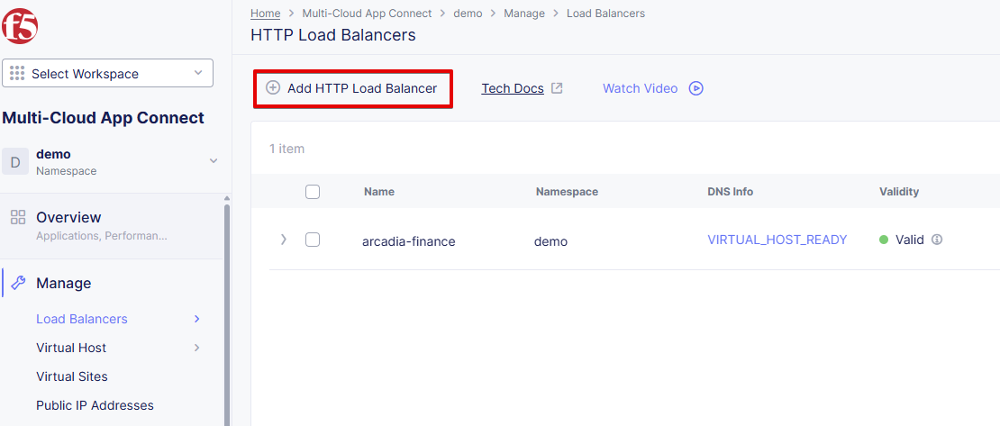

Give this Load Balancer a name. For this use case we will use **friends-module**.

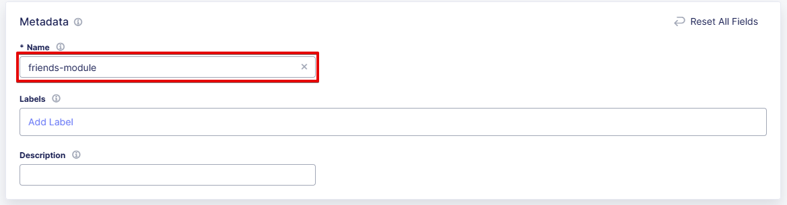

Now we need to provide a domain name for our workload. In this use case we will specify **friends.yawning-white-antelope.github.securelab.online**. Then open the drop-down menu to select Load Balancer type - **HTTP** and check off the box to enable automatic managing of DNS records. Make sure port **80** is specified. 

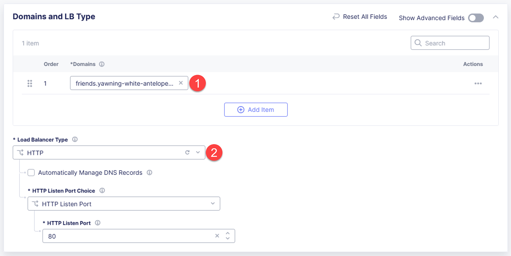

After that let's create a new origin pool, which will be used in our load balancer. Click **Add Item** to open the pool creation form.

.. figure:: assets/cloud_b_lb_pool_add.png

Then open the drop-down menu and click **Add Item**.

.. figure:: assets/cloud_b_lb_origin_create.png

To configure the origin pool we'll add a pool name, followed by a set of config options for the pool. First, let's give this pool a name - **friends-origin**. Next we need to configure the port - **80**. And then click **Add Item** to start configuring an origin server.

.. figure:: assets/cloud_b_lb_origin_meta.png

First open the drop-down menu to specify the type of origin server. For this use case select **IP address of Origin Server on given Sites**. Then specify IP - **10.0.20.100**. After that we need to select the **cloud-b** site. Finally, make sure **Inside Network** is specified. Complete by clicking **Apply**.

.. figure:: assets/cloud_b_lb_origin_add_server.png

Then click **Add Origin Pool** to move on.

Once done, click **Apply** to apply the origin pool to the load balancer configuration. This will return to the load balancer configuration form.

.. figure:: assets/cloud_b_lb_pool_continue.png

Finally, configure the HTTP Load Balancer to Advertise the VIP to **cloud-a** for this use case. Select **Custom** for VIP Advertisement, which configures the specific sites where the VIP is advertised. And then click **Configure**.

.. figure:: assets/cloud_b_lb_avertisement.png

Click **Add Item** to add the configuration.

.. figure:: assets/cloud_b_lb_avertisement_add.png

Make sure **Site** is specified as a place to advertise. Then select **Inside Network** for the site. And finally, select **cloud-a** as site reference. Click **Apply** to add the specified configuration. 

.. figure:: assets/cloud_b_lb_avertisement_add_details.png

Proceed by clicking **Apply**. This will apply the VIP Advertisement configuration to the HTTP Load Balancer. 

.. figure:: assets/cloud_b_lb_avertisement_continue.png

Take a look at the load balancer configuration and finish creating it by clicking **Add HTTP Load Balancer**.

.. figure:: assets/cloud_b_lb_save.png

Now that we've configured the HTTP Load Balancer, we need to run the following command in CLI to extract the private IP value for our site from the Cloud A file: 

.. figure:: assets/cloud_b_terraform_output.png

The output will show us the private IP address for our site deployed by Distributed Cloud Services. 

Open `Arcadia DNS Tool <https://tool.xc-mcn.securelab.online>`_ and type in the IP address for the DNS server. Click **Update**.  

As soon as the DNS is updated, we can go to our website and see that a new module is now active - Refer a friend. 

.. figure:: assets/cloud_b_app.png 

################

Module 3: Back-end Service via Sites/Global Network (Layer 3) in Cloud C
************************************************************************

In this module we will connect the Arcadia Core app (back-end service) to another apps service: The Transaction Module. We will use a different approach from the previous module, by using the Layer 3 connectivity via F5 Distributed Cloud Multi-Cloud Networking via Sites/Global Network.

But first, we need to configure our last cloud provider (Cloud C) by following the `Terraform instructions <./terraform/cloud-c>`_. 

If you have previously used AWS for Cloud A and Azure for Cloud B, we recommend that you choose Azure for Cloud C (the scripts will create another Resource Group / VNET in Azure). If you have access to just one provider, continue with the scripts for that provider and a different VPC or Resource Group / VNET will be created. 

At the end of this module, we will have the following architecture for our app services:

.. figure:: assets/layer-3.png

Assuming you now have your Cloud C confirmed, let's move on to create and configure a Global Network in Cloud A VPC site. Open the service menu and proceed to **Multi-Cloud Network Connect**.

.. figure:: assets/cloud_c_aws_1.png

In **Site Management** select **AWS VPC Sites** to see the site created. 

.. figure:: assets/cloud_c_aws_2.png

Open the menu of Cloud A site and select **Manage Configuration**.

In order to enable the editing mode, click **Edit Configuration**.

Scroll down to the **Site Type Selection** section, find the **Select Ingress Gateway or Ingress/Egress Gateway** part and click **Edit Configuration**. 

.. figure:: assets/cloud_c_aws_5.png

Open the drop down menu to select global networks to connect and click **Add Item** to start creating Global Network.

Open the list of the Global Virtual Networks and click **Add Item**.

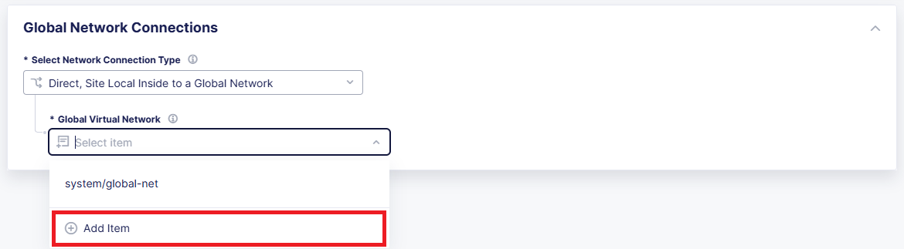

First, give it a name. Then make sure **Global Network** is specified. Finally, click **Add Virtual network** to proceed.

.. figure:: assets/cloud_c_aws_8.png

Take a look at the Network and click **Apply**. 

.. figure:: assets/cloud_c_aws_9.png

The created Global Network will appear in the site configuration. Look it through and click **Apply**.

.. figure:: assets/cloud_c_aws_10.png

To complete the process we will click **Save AWS VPC Site**. 

.. figure:: assets/cloud_c_aws_11.png

Now we will add the Global Network we created to Cloud C, Azure VNET site. In the **Multi-Cloud Network Connect** service, navigate to **Azure VNET Sites** through **Site Management**.

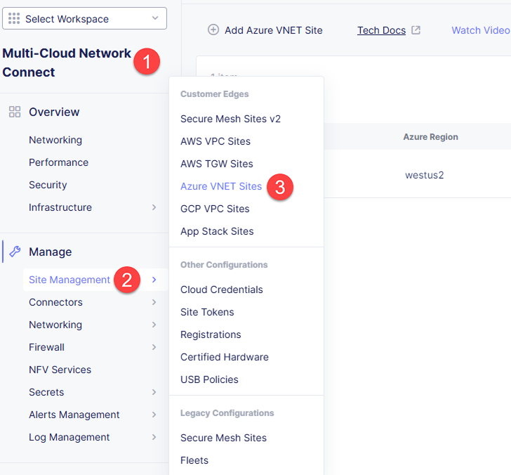

Open site menu and select **Manage Configuration** to add the Global Network to Azure VNET site.

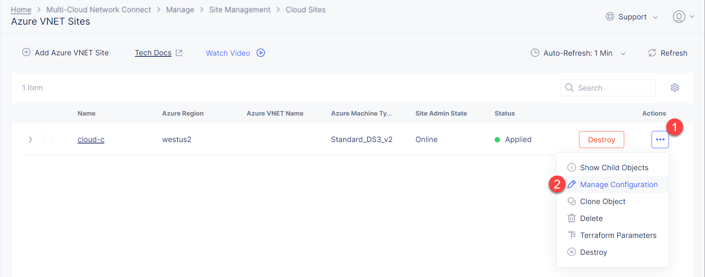

Enable editing configuration by clicking **Edit Configuration**.

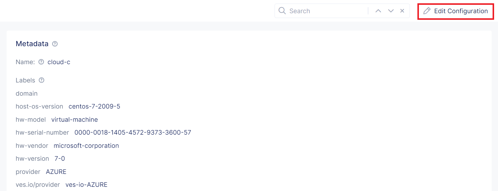

Scroll down the configuration to the **Site Type Selection** section and click **Edit Configuration** under **Ingress/Egress Gateway (Two Interface) on Recommended Region**.

First, enable showing advanced fields, and then select the global network to connect. Click **Add Item**.

.. figure:: assets/cloud_c_azure_5.png

Open the list of networks and select the one we created earlier. Then add it by clicking **Apply**.

Apply the updated configuration to the Site by clicking **Apply**.

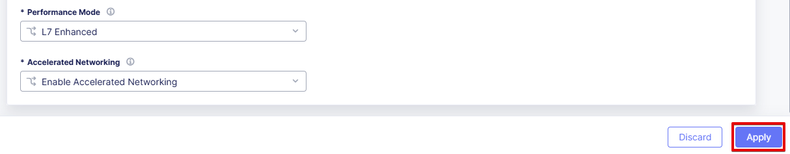

Take a look at the configuration and complete updating by clicking **Add Azure VNET Site**.

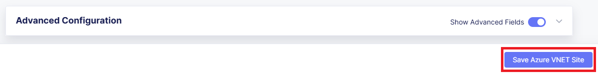

Next we need to specify routes in the clouds. In this demo we already did it. You can take a look at the screenshot taken from Cloud A below.

.. figure:: assets/cloud_c_routes.png

Now let's test the connected modules. We will open the site and see that now all the modules are active, including the Transactions. 

.. figure:: assets/cloud_c_app.png

Let's now take a look at site monitoring and visibility. In the **Multi-Cloud Network Connect** service navigate to **Performance**. First, we will see the **Dashboard** tab. The dashboard shows all the insights, including alerts, interface status, data plane health and control plane health. We can also see the top 10 links filtered by various criteria, such as throughput, latency and drop rate.

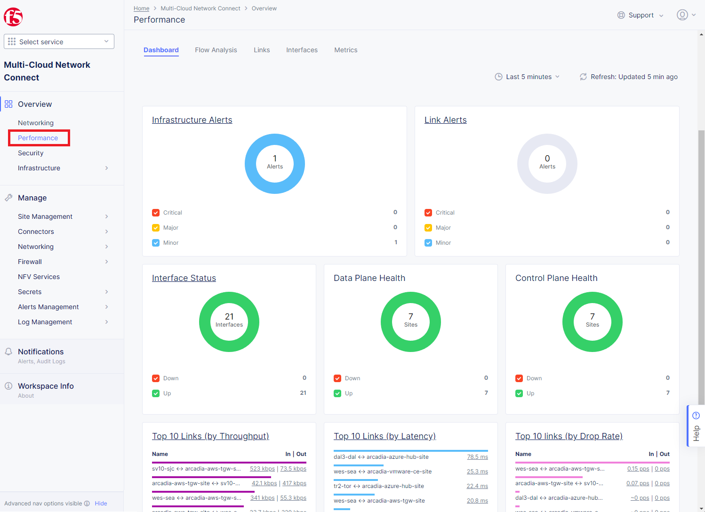

Next let's go to the **Links** tab and some link analytics, including status, latency, data plane reachability, throughput and drop rate. We can see that our links are up and running with high connectivity.    

.. figure:: assets/monitoring_2.png

And finally, we will take a look at statistics by interface on each F5 Distributed Cloud Services node. Proceed to the **Interfaces** tab to see the site the interface refers to, its status and throughput, as well as drop rate.   

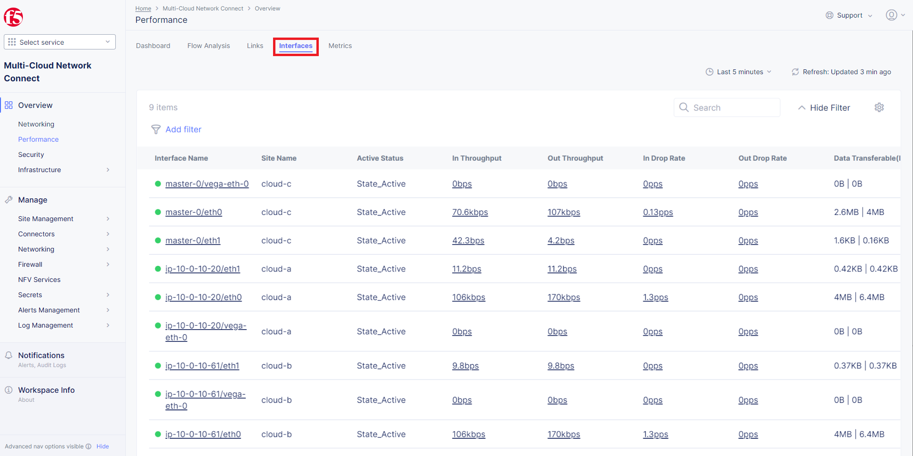

Wrap-Up
#######

At this stage you should have set up a sample app environment used various multi-cloud networking features to securely network and control your app services. You also should be familiar with the telemetry and insights from the dashboards for the various MCN services. 

We hope you have a better understanding of the F5 Distributed Cloud MCN services and are now ready to implement it for your own organization. Should you have any issues or questions, please feel free to raise them via GitHub. Thank you!
