==================================================

.. contents:: Table of Contents

Objective
####################
Use this guide and the provided sample app, included scripts and utility app to explore the Multi-Cloud Networking (MCN) use-cases of the F5 Distributed Cloud platform (XC). This will help you get familiar with the following features & capabilities: 

- MCN Cloud-to-Cloud via HTTP Load Balancer (Layer 7)
- MCN Cloud-to-Cloud via Global Network (Layer 3)
- Verify Application and Routing

Each of the modules in this guide addresses a specific use-case with a help of included Terraform scripts. With Terraform scripts you can simplify the deployment of a sample app components in multiple cloud environments,

Public Cloud (multi-cloud), Modules & Scripts
##############################################

The contents of the guide is divided into modules, which can be used separately or together in order to explore a particular Multi-Cloud Networking use-case. Each module contains a set of `Terraform scripts <./terraform>`_ for different public clouds. These modules are intended to simplify deployment of sample app services in three different clouds: Cloud A, Cloud B, and Cloud C in order to work through different MCN use-cases.

Note: The lab for F5 TechXchange uses the F5 UDF environment, and for simplicity only leverages the AWS public cloud. As a result, all resources deployed for F5 TechXchange 2023 will be deployed to AWS. After TechXchange, we recommend trying this lab across two different public cloud providers for the most representative MCN experience.

* Cloud A: AWS

  - 1x VPC (10.0.0.0/16 CIDR)
  - 1x F5 XC Node
  - 1x Arcadia frontend app (EC2 instance)

* Cloud B: AWS - simulating multi-cloud with IP overlap

  - 1x VPC (10.0.0.0/16 CIDR) - IP Overlap!!
  - 1x F5 XC Node
  - 1x Arcadia friends app (EC2 instance)

* Cloud C: AWS - simulating multi-cloud with global network transit layer 3

  - 1x VPC (192.168.0.0/16)
  - 1x F5 XC Node
  - 1x Arcadia money transfer app (EC2 instance)

Pre-requisites
#################

- F5 UDF Blueprint = TBD
- A Web browser to access the F5 Distributed Cloud console

Scenario
####################

The XC MCN is a complete multi-cloud networking solution to deploy distributed applications across clouds and edge sites. This demo is intended to be self-sufficient as a quick way to familiarize with some of the main MCN use-cases supported by the XC platform. We’ll use a representative customer app scenario with multiple app services distributed across different clouds: a fictitious Arcadia Finance app which is representative of a typical banking website with features such as customer login, statements, and bank transfers. This customer is looking to add to its website additional banking services, such as a Refer-a-Friend Widget and a Transactions Module, which are developed and managed by other teams, and are deployed/running on public cloud infrastructure other than the core banking app. 

The initial state of the Arcadia Finance website features several "Coming Soon" placeholders for the additional banking services which will "come online" as soon as the networking is properly configured. We will use F5 Cloud Services Multi-Cloud Networking to quickly connect these new services into the core banking module by way of XC MCN features. Once properly networked, these features will be turned.

.. figure:: assets/mcn-overview.gif

Module Overview
################

Module 1: Front-end Portal deployed in Cloud A
**********************************************

In this module we will deploy front-end portal in Cloud A with Terraform scripts for AWS and use F5 Distributed Cloud Services to configure HTTP LB for front-end. We will use a tool to generate a domain entry. This use case supposes SSL offloading, the process of removing the SSL-based encryption from incoming traffic to relieve a web server of the processing burden of decrypting and/or encrypting traffic sent via SSL.

.. figure:: assets/ssl-offload.png

Prepare Lab Environment
~~~~~~~~~~~~~~~~~~~~~~~

1. Open the UDF Blueprint "F5 TechXchange 2023 XC MCN (TBD)" https://xxx.xxx.xxx and click "Deploy" to create a deployment. Then hit "Start".

> *Once you start the UDF deployment, it will create an ephemeral account on the F5 Distributed Cloud console (this may take 5-10 min). Then you will receive an email to update your password.*

2. Access the UDF jumphost via xRDP desktop session.

======  ========
User    Password
======  ========
ubuntu  HelloUDF
======  ========

.. figure:: assets/udf/udf-jumphost-xrdp.png

3. Open a terminal on the jumphost. Clone the lab repository and change into the directory.

.. code:: bash

     git clone https://github.com/f5devcentral/f5xc-mcn-TechXchange.git
     cd f5xc-mcn-TechXchange/

4. Copy the tfvars file.

.. code:: bash

     cp admin.auto.tfvars.example admin.auto.tfvars

5. Edit the file using "vi" in the terminal so you can customize the parameter values for your lab like owner, keys, and zone. You will retrieve the values in the following steps. 

.. code:: bash

     vi admin.auto.tfvars

     # Editing Tips
     # 1. type "i" for insert
     # 2. hit "ESC" key to quit editing mode
     # 3. hold shift + ZZ to save

     # Example Values
     # owner          = "lastname"
     # api_url        = "https://f5-sales-demo.console.ves.volterra.io/api"
     # api_p12_file   = "/home/ubuntu/Downloads/f5-sales-demo.console.ves.volterra.io.api-creds.p12"
     # aws_access_key = "accesskeyxxxx"
     # aws_secret_key = "secretxxxx"
     # zone_name      = "your.domain.com"

6. Open the `Arcadia DNS Tool <https://tool.xc-mcn.securelab.online>`_ and copy your Zone Name. Paste the value in the tfvars file for "zone_name".

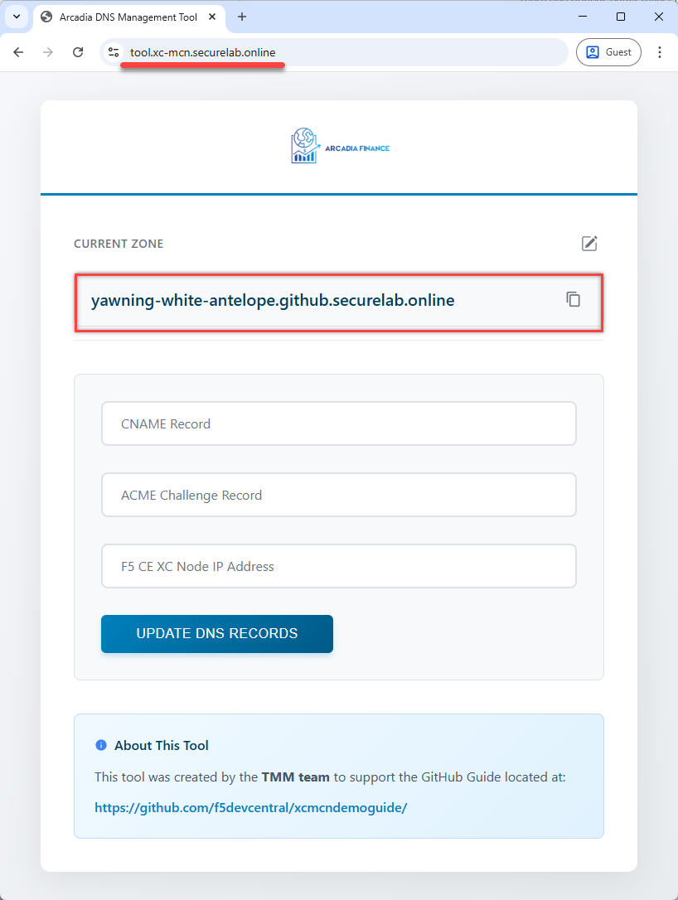

7. On the UDF deployment page, click the "Cloud Accounts" tab and copy the values for "API Key" and "API Secret". Paste the values in the tfvars file for "aws_access_key" and "aws_secret_key". The AWS Access Key and the Secret Key can be used to create the **AWS Programmatic Access Credentials** on F5 Distributed Cloud Console. See `AWS Cloud Credentials <https://docs.cloud.f5.com/docs/how-to/site-management/cloud-credentials#aws-programmable-access-credentials>`_  for more information.

.. figure:: assets/udf/udf-cloud-account-api.png

8. Using a jumphost web browser, open the XC Console https://f5-sales-demo.console.ves.volterra.io and click **Administration** tab.

.. figure:: assets/xc/administration.png

9. Open **Credentials** section and click **Add Credentials**.

.. figure:: assets/xc/create_credentials.png

10. Fill in the details and download your credentials file. The p12 file will download to /home/ubuntu/Downloads/f5-sales-demo.console.ves.volterra.io.api-creds.p12 and is used in tfvars as the value for "api_p12_file". DO NOT change the path! If you do, then you will need to make sure the tfvars value matches too!

Note: Remember the "Password" as it will be used for **VES_P12_PASSWORD** in the next step.

.. figure:: assets/xc/fill_credentials.png

11. Return to the jumphost terminal. Save the tfvars file and exit "vi" mode.

.. code:: bash

     # Editing Tips
     # 1. hit "ESC" key to quit editing mode
     # 2. hold shift + ZZ to save

12. Create **VES_P12_PASSWORD** environment variable with the password from the previous step.

Note: Keep the terminal window open.

.. code:: bash

     export VES_P12_PASSWORD=your_certificate_password

Deploy with Terraform
~~~~~~~~~~~~~~~~~~~~~~~

1. Return to the jumphost terminal within the xRDP session. Deploy the Terraform code for "Cloud A" by running the script **./cloud-A-setup.sh**.

.. code:: bash

     ./cloud-A-setup.sh

2. Open F5 Distributed Cloud Console and navigate to the **Cloud and Edge Sites** tab.

.. figure:: assets/xc/cloud_a_sites.png

3. Open **Site List** and check the **Health Score**. It may take some time to provision the node.

.. figure:: assets/xc/cloud_a_ready.png

Create HTTP LB
~~~~~~~~~~~~~~~

Next set up the HTTP Load Balancer.

1. In the F5 Distributed Cloud Console navigate to the **Load Balancers** service in the service menu.

.. figure:: assets/open_lb.png

2. Select **HTTP Load Balancers**. Then click the **Add HTTP Load Balancer** button to open the form of HTTP Load Balancer creation.

3. Give it a name. For this demo we will use **arcadia-finance**.

.. figure:: assets/cloud_a_lb_metadata.png

4. Next we need to provide a domain name for our workload: a domain can be delegated to F5, so that Domain Name Service (DNS) entries can be created quickly in order to deploy and route traffic to our workload within seconds. In this demo we use the domain name supplied by the Arcadia DNS tool which is unique for each lab student (ex. **"yawning-white-antelope.github.securelab.online"**). Then check off the boxes to redirect HTTP to HTTPS, and add HSTS Header.

.. figure:: assets/cloud_a_lb_domains.png

5. After that let's create a new origin pool, which will be used in our load balancer. The origin pools are a mechanism to configure a set of endpoints grouped together into a resource pool that is used in the load balancer configuration. Click **Add Item** to open the pool creation form.

.. figure:: assets/cloud_a_lb_origins.png

6. Then open the drop-down menu and click **Create new Origin Pool**.

.. figure:: assets/cloud_a_lb_create_origin.png

7. To configure the origin pool we'll add a pool name, followed by a set of config options for the pool. First, let's give this pool a name. Next we need to configure the port (the end point service/workload available on this port). In this demo it's Port **80**. And now click **Add Item** to start configuring an origin server.

.. figure:: assets/cloud_a_lb_origin_details.png

8. Let's now configure origin server. First open the drop-down menu to specify the type of origin server. For this demo select **IP address of Origin Server on given Sites**. Then specify IP - **10.0.20.100** for this demo. After that we need to select **Site** as Site type and specify it as **cloud-a**. Finally, the last step to configure the origin server is specifying network on the site. Select **Inside Network**. Complete by clicking **Add Item**.

.. figure:: assets/cloud_a_lb_origin_server.png

9. Then just click **Continue** to move on.

.. figure:: assets/cloud_a_lb_origin_details_save.png

10. Once done, click **Add Item** to apply the origin pool to the load balancer configuration. This will return to the load balancer configuration form.

.. figure:: assets/cloud_a_lb_origin_save.png

11. Take a look at the load balancer configuration and finish creating it by clicking **Save and Exit**.

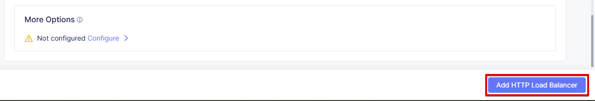

Update DNS
~~~~~~~~~~~~

You will see the created HTTP Load Balancer. Now we need to copy the host name in order to delegate the domain.

1. Open the menu of HTTP Load Balancer we've just created and select **Manage Configuration**.  

.. figure:: assets/cloud_a_lb_dns_open.png

2. Copy host name you see in the configuration. Host name will be used as CNAME value for the domain. After copying the host name, move on and copy CNAME value. It will be used to create an HTTPS certificate. 

.. figure:: assets/cloud_a_lb_dns_details.png

3. Open `Arcadia DNS Tool <https://tool.xc-mcn.securelab.online>`_ and paste the host name as **CNAME record** and the CNAME value as **ACME_CHALLENGE record**. Then click **Update** to update DNS and create the certificate. 

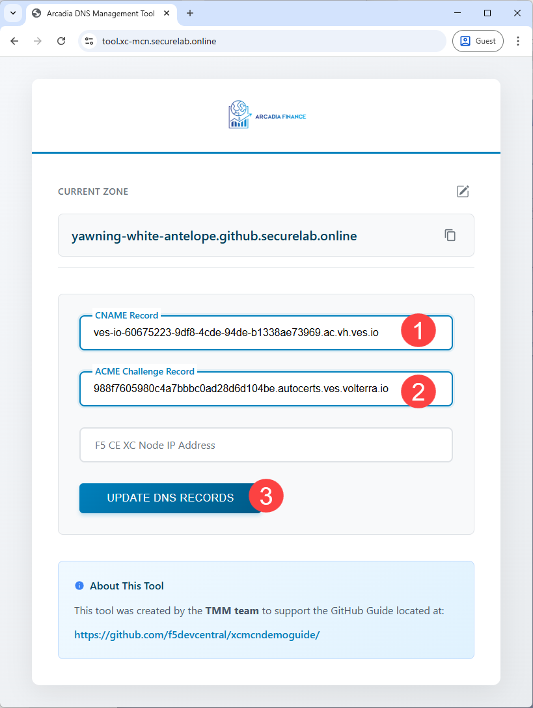

4. Check the status in the XC Console. It may take a few minutes to update the DNS info and generate and apply the certificate. You will see their updated status as below:

.. figure:: assets/cloud_a_lb_dns_valid.png

Test Application
~~~~~~~~~~~~~~~~~

Now that the DNS is updated and the certificate is active, let's proceed to the website and test.

1. Go to **yawning-white-antelope.github.securelab.online** and see if the certificate of the site is valid. 

Note: your FQDN will be different!

.. figure:: assets/cloud_a_lb_website.png

2. Let's now log in. Use the following credentials:

======  =========
User    Password
======  =========
admin   iloveblue
======  =========

.. figure:: assets/cloud_a_lb_website_login.png

After we enter the website, we can see it's up and running. We can also see that there are a few modules that are still not active - Refer a friend and Transactions. We will configure them in the following steps.

.. figure:: assets/cloud_a_lb_website_sections.png

3. Next let's navigate to the XC Console **App Traffic** to see the current traffic flow. It shows us traffic coming from clients to Cloud A through F5 PoP with SSL offloading which provides security and speed.  

.. figure:: assets/app_traffic_1.png

4. And finally, let's take a look at the HTTP Load Balancer dashboard. Proceed to **HTTP Load Balancers** and then click on the created one. 

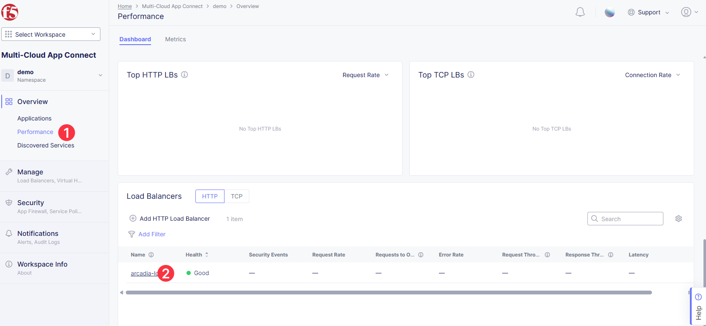

We can see a view for entire performance monitoring information. Dashboard shows sections such as healthscore, active alerts, metrics, clients, devices, policy, security, etc. Metrics include requests, throughputs, and latency. Client information includes details such as top clients, TLS fingerprints, client location, etc.
Device information includes device type and browser type. 

.. figure:: assets/app_traffic_3.png

################

Module 2: Back-end Service via HTTP LB (Layer 7) in Cloud B
***********************************************************

In this module we will connect the Refer-a-Friend Widget, which will be running in our Cloud B. We will create another HTTP Load Balancer (Layer 7), and make it available on the Arcadia Finance website, which was previously inactive in the step above. 

But first, we need to configure our second cloud (Cloud B). It is recommended that for Cloud B you use a provider different from the one you've configured for Cloud A. However, we will use AWS for Cloud B since the F5 UDF environment only has AWS permissions. 

Below is the service topology we will achieve at the end of this module. Note the IP overlap of the Core Module IP (deployed in the previous step), and the IP of the Refer-a-Friend service (also 10.0.20.100). This is a perfect opportunity to use an HTTP Load Balancer!

.. figure:: assets/layer-7.png

Deploy with Terraform
~~~~~~~~~~~~~~~~~~~~~~~

1. Deploy the Terraform code for "Cloud B" by running the script **./cloud-B-setup.sh**.

.. code:: bash

     ./cloud-B-setup.sh

2. You can check status in the F5 Distributed Cloud Console, **Cloud and Edge Sites**, **Site List** and check the **Health Score**. It may take some time to provision the node.

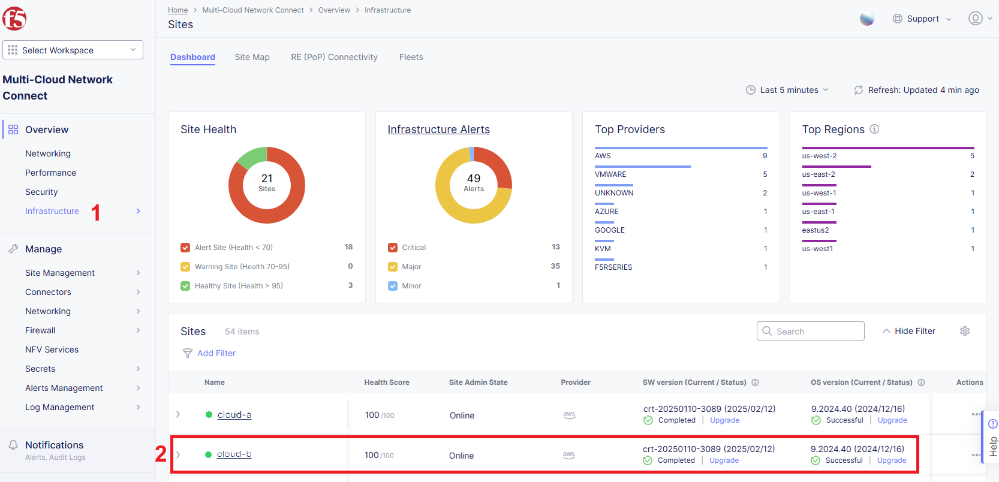

Create HTTP LB
~~~~~~~~~~~~~~~

Assuming you now have your Cloud B confirmed, let's create one more HTTP Load Balancer for this use case.

1. Navigate to **Load Balancers** and select **HTTP Load Balancers**. Then click the **Add HTTP Load Balancer** button to open the form of HTTP Load Balancer creation.

.. figure:: assets/cloud_b_lb_create.png

2. Give this Load Balancer a name. For this use case we will use **friends-module**.

.. figure:: assets/cloud_b_lb_metadata.png

3. Now we need to provide a domain name for our workload. In this use case we will specify **friends.yawning-white-antelope.github.securelab.online**. Then open the drop-down menu to select Load Balancer type - **HTTP** and check off the box to enable automatic managing of DNS records. Next we need to specify the port. We will use Port **80** for this use case. 

Note: your FQDN will be different!

.. figure:: assets/cloud_b_lb_dns.png

4. After that let's create a new origin pool, which will be used in our load balancer. Click **Add Item** to open the pool creation form.

.. figure:: assets/cloud_b_lb_pool_add.png

5. Then open the drop-down menu and click **Create new Origin Pool**.

.. figure:: assets/cloud_b_lb_origin_create.png

6. To configure the origin pool we'll add a pool name, followed by a set of config options for the pool. First, let's give this pool a name - **friends-origin**. Next we need to configure the port - **80**. And then click **Add Item** to start configuring an origin server.

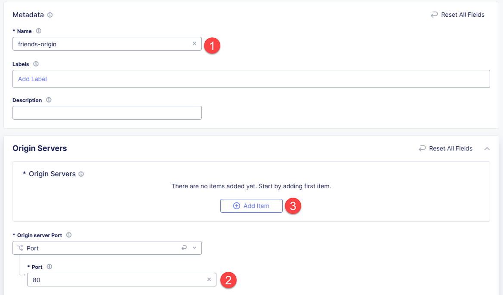

7. First open the drop-down menu to specify the type of origin server. For this use case select **IP address of Origin Server on given Sites**. Then specify IP - **10.0.20.100**. After that we need to select **Site** as Site type and specify it as **cloud-b**. Finally, the last step to configure the origin server is specifying network on the site. Select **Inside Network**. Complete by clicking **Add Item**.

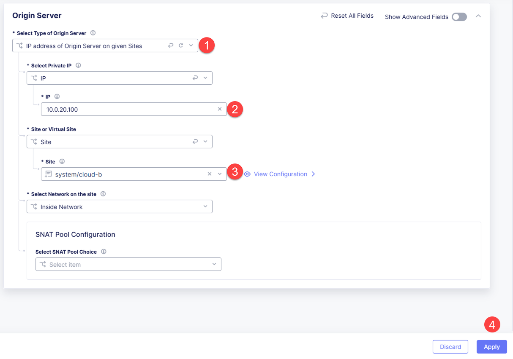

8. Then click **Continue** to move on.

.. figure:: assets/cloud_b_lb_origin_continue.png

9. Once done, click **Add Item** to apply the origin pool to the load balancer configuration. This will return to the load balancer configuration form.

10. Finally, configure the HTTP Load Balancer to Advertise the VIP to **cloud-a** for this use case. Select **Custom** for VIP Advertisement, which configures the specific sites where the VIP is advertised. And then click **Configure**.

.. figure:: assets/cloud_b_lb_avertisement.png

11. Click **Add Item** to add the configuration.

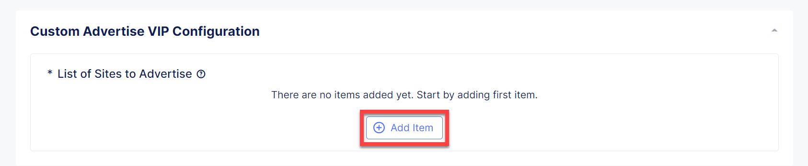

12. In the drop down menu select **Site** as a place to advertise. Then select **Inside Network** for the site. And finally, select **cloud-a** as site reference. Click **Add Item** to add the specified configuration. 

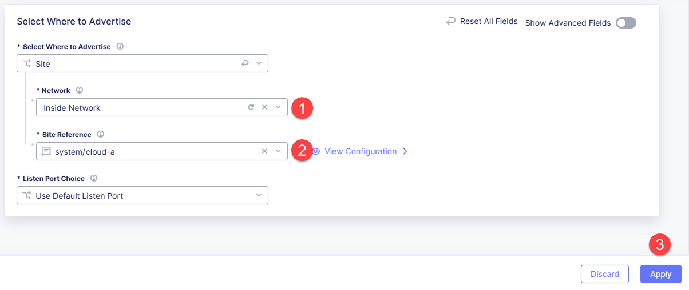

13. Proceed by clicking **Apply**. This will apply the VIP Advertisement configuration to the HTTP Load Balancer. 

14. Take a look at the load balancer configuration and finish creating it by clicking **Save and Exit**.

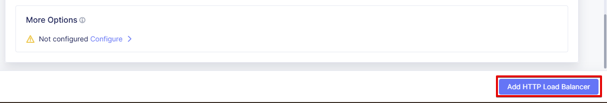

Update DNS
~~~~~~~~~~~~

1. Now that we've configured the HTTP Load Balancer, we need to run the following command in CLI to extract the private IP value for our site from the Cloud A file: 

.. code:: bash

     terraform -chdir=terraform/cloud-a/aws output

The output will show us the private IP address for our site deployed by F5 Distributed Cloud Services.

.. code:: bash

     # example
     xc_node_private_ip = "10.0.20.34"
     xc_node_private_nic_id = "eni-0d64d56fe2e9bcadc"

2. Open `Arcadia DNS Tool <https://tool.xc-mcn.securelab.online>`_ and type in the IP address for the DNS server. Click **Update**.  

.. figure:: assets/cloud_b_dns_update.png

Test Application
~~~~~~~~~~~~~~~~~

As soon as the DNS is updated, we can go to our website and see that a new module is now active - Refer a friend. 

.. figure:: assets/cloud_b_app.png 

################

Module 3: Back-end Service via Sites/Global Network (Layer 3) in Cloud C
************************************************************************

In this module we will connect the Arcadia Core app (back-end service) to another apps service: The Transaction Module. We will use a different approach from the previous module, by using the Layer 3 connectivity via F5 Distributed Cloud Multi-Cloud Networking via Sites/Global Network.

But first, we need to configure our last cloud provider (Cloud C). We will once again use AWS since the F5 UDF environment only has access to AWS.

At the end of this module, we will have the following architecture for our app services:

.. figure:: assets/layer-3.png

Deploy with Terraform
~~~~~~~~~~~~~~~~~~~~~~~

1. Deploy the Terraform code for "Cloud C" by running the script **./cloud-C-setup.sh**.

.. code:: bash

     ./cloud-C-setup.sh

2. You can check status in the F5 Distributed Cloud Console, **Cloud and Edge Sites**, **Site List** and check the **Health Score**. It may take some time to provision the node.

Create Global Network
~~~~~~~~~~~~~~~~~~~~~

Assuming you now have your Cloud C confirmed, let's move on to create and configure a Global Network in Cloud A VPC site.

1. Open the service menu and proceed to **Cloud and Edge Sites**.

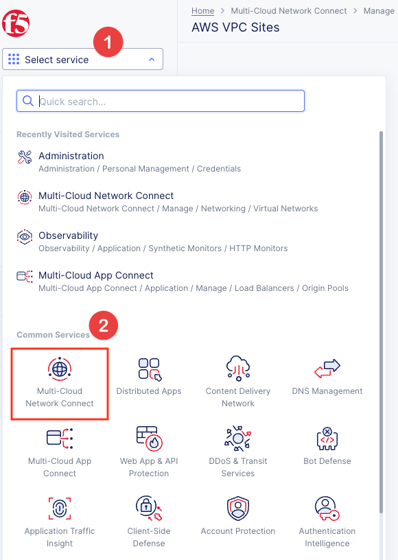

2. In **Site Management** select **AWS VPC Sites** to see the site created. 

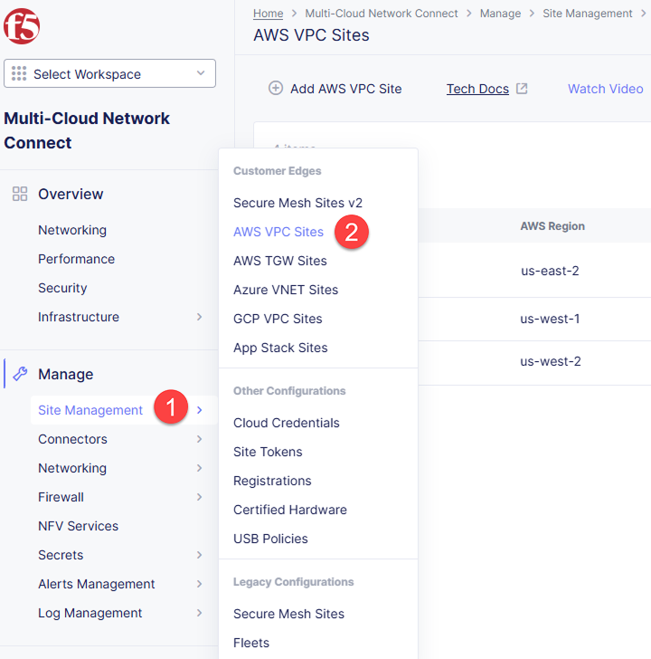

3. Open the menu of Cloud A site and select **Manage Configuration**.

.. figure:: assets/cloud_c_aws_3.png

4. In order to enable the editing mode, click **Edit Configuration**.

.. figure:: assets/cloud_c_aws_4.png

5. Scroll down to the **Networking Config** and click **Edit Configuration**. 

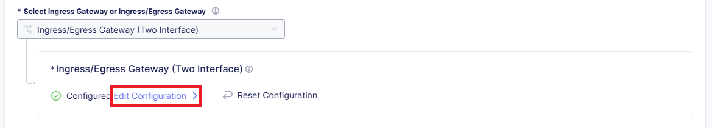

6. Open the drop down menu to select global networks to connect and click **Add Item** to start creating Global Network.

.. figure:: assets/cloud_c_aws_6.png

7. Open the list of the Global Virtual Networks and click **Create new Virtual Network**.

.. figure:: assets/cloud_c_aws_7.png

8. First, give it a *unique* name (ex. yourlastname-arcadia-global). Then move on and select type of network in the drop down menu. For this use case we will need Global Network. Finally, click **Continue** to proceed.

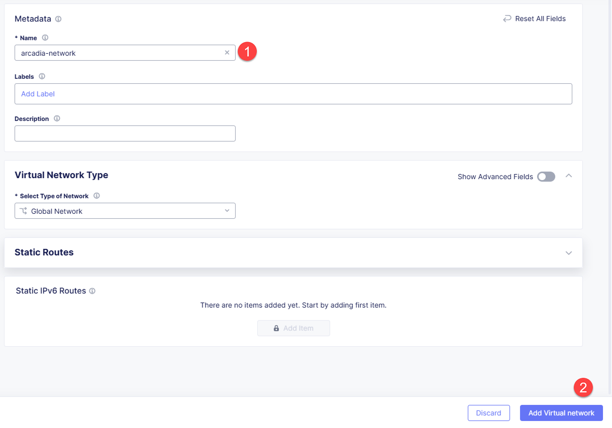

9. Take a look at the Network and click **Add Item**. 

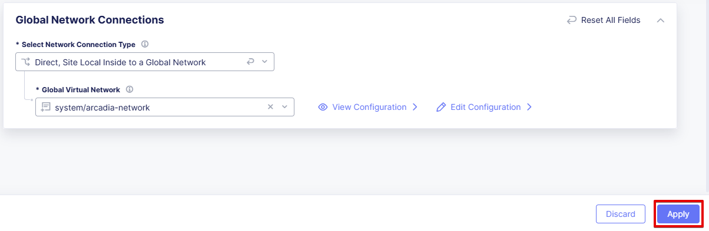

10. The created Global Network will appear in the site configuration. Look it through and click **Apply**.

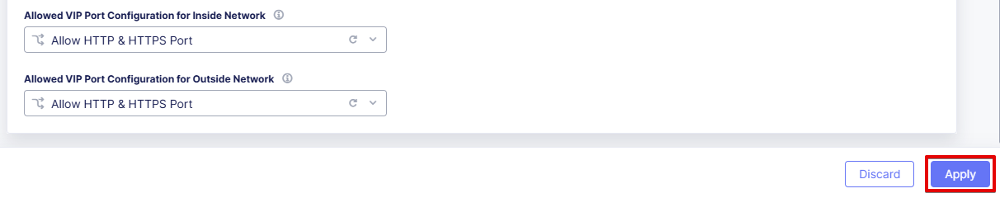

11. To complete the process we will click **Save and Exit**. 

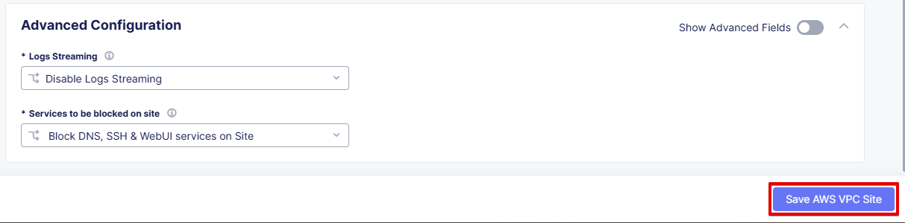

Now we will add the Global Network we created to Cloud C, AWS VPC site. We can do this connectivity since there is non-overlapping IP space. If you recall, Cloud A is configured with 10.0.0.0/16 CIDR, and Cloud C is configured with 192.168.0.0/16 CIDR.

12. Open the Cloud C site menu and select **Manage Configuration** to add the Global Network to AWS VPC site.

.. figure:: assets/cloud_c_aws_12.png

13. Enable editing configuration by clicking **Edit Configuration**.

.. figure:: assets/cloud_c_aws_13.png

14. Scroll down the configuration and click **Edit Configuration** under **Networking Config**.

.. figure:: assets/cloud_c_aws_14.png

15. First, enable showing advanced fields, and then select the global network to connect. Click **Add Item**.

.. figure:: assets/cloud_c_aws_15.png

16. Open the list of networks and select the one we created earlier. Then add it by clicking **Add Item**.

.. figure:: assets/cloud_c_aws_16.png

17. Apply the updated configuration to the Site by clicking **Apply**.

18. Take a look at the configuration and complete updating by clicking **Save and Exit**.

Update Routes in Cloud A
~~~~~~~~~~~~~~~~~~~~~~~~

Next we need to configure routing. Traffic between Cloud A and Cloud C will use the XC Global Network. This is achieved with route table entries, matching address prefixes, and setting next hop as the XC node's network interface. This demo already created a route table entry for Cloud A to reach Cloud C via the XC Global Network.

Login to Cloud A (AWS) to validate existing routes.

1. On the UDF deployment page, click the "Cloud Accounts" tab and copy the value for "Console Password". Then open the "Console URL" to login to AWS.

.. figure:: assets/udf/udf-cloud-account-console.png

================  ================
Console Username  Console Password
================  ================
udf               <redacted>
================  ================

2. Change the AWS Region to match Cloud A. For this demo, you deployed to "us-east-2" US East (Ohio).

.. figure:: assets/cloud_a_region.png

3. Navigate to VPC.

.. figure:: assets/cloud_aws_console_vpc.png

4. Select Route Tables.

.. figure:: assets/cloud_aws_console_route_tables.png

5. Select the Cloud A public route table and view the Routes.

Note: The Terraform code in this demo assigns "Name" with a value of "cloud-a-public-route-table". Unfortunately, the XC node deployment also updates "Name" and changes the value. Therefore, your public route table might be named differently. If this is the case, choose the route table with "-outside" as the suffix.

.. figure:: assets/cloud_a_route_table_public1.png

Alternatively, you can re-run the Cloud A setup script to apply the correct tags and values.

.. code:: bash

     ./cloud-A-setup.sh

     # example output
     Terraform will perform the following actions:

     # aws_route_table.public will be updated in-place
     ~ resource "aws_route_table" "public" {
          id               = "rtb-0d4ebe7caae0c2ac0"
          ~ tags             = {
               "Environment"             = "cloud-a"
               ~ "Name"                    = "CGyYiprZO-outside" -> "cloud-a-public-route-table"

     Plan: 0 to add, 1 to change, 0 to destroy.
     ...snippet...

.. figure:: assets/cloud_a_route_table_public2.png

Items of importance...

==============================  =========
Destination                     Target
==============================  =========
192.168.0.0/16 << Cloud C CIDR  eni-0d64d56fe2e9bcadc << Cloud A XC node NIC ID
==============================  =========

What does this mean? Subnets in Cloud A that are associated with this route table will send 192.168.0.0/16 destination traffic to the XC node as the next hop.

Update Routes in Cloud C
~~~~~~~~~~~~~~~~~~~~~~~~

At this point in the lab, you validated that Cloud A has route entries to reach Cloud C. Now you need to setup similar routing in Cloud C to allow return traffic.

First, identify the target network interface (ENI) for the XC node in Cloud C.

1. Return to the AWS Console Home and navigate to EC2.

.. figure:: assets/cloud_aws_console_ec2.png

2. Select Instances.

.. figure:: assets/cloud_aws_ec2_instances.png

3. Change the AWS Region to match Cloud C. For this demo, you deployed to "us-west-2" US West (Oregon).

.. figure:: assets/cloud_c_region.png

4. Select the XC instance "master-0", click "Networking" tab, then copy the private interface ENI ID. This will be used as the route entry "target".

.. figure:: assets/cloud_c_eni_ids.png

5. Optionally, you can further validate the "inside" interface by selecting the ENI (click the link). Then click the "Tags" tab to see more details about this interface.

.. figure:: assets/cloud_c_eni_tags.png

Next, you will use the ENI ID to create a route entry.

6. Navigate to VPC.

.. figure:: assets/cloud_aws_console_vpc.png

7. Select Route Tables.

.. figure:: assets/cloud_aws_console_route_tables.png

8. Select the Cloud C public route table.

Note: The Terraform code in this demo assigns "Name" with a value of "cloud-c-public-route-table". Unfortunately, the XC node deployment also updates "Name" and changes the value. Therefore, your public route table might be named differently. If this is the case, choose the route table with "-outside" as the suffix.

.. figure:: assets/cloud_c_route_table_public1.png

Alternatively, you can re-run the Cloud C setup script to apply the correct tags and values.

.. code:: bash

     ./cloud-C-setup.sh

     # example output
     Terraform will perform the following actions:

     # aws_route_table.public will be updated in-place
     ~ resource "aws_route_table" "public" {
          id               = "rtb-0fdef2c59eb633906"
          ~ tags             = {
               "Environment"             = "cloud-c"
               ~ "Name"                    = "7gS4kTqtj-outside" -> "cloud-c-public-route-table"

     Plan: 0 to add, 1 to change, 0 to destroy.
     ...snippet...

9. Select "Edit Routes" to create a new route entry.

.. figure:: assets/cloud_c_route_table_public2.png

10. Click "Add route", supply details, then "Save Changes".

.. figure:: assets/cloud_c_route_table_public3.png

Items of importance...

==============================  =========
Destination                     Target
==============================  =========
10.0.0.0/16 << Cloud A CIDR     eni-05dcbec0b9eade0c4 << Cloud C XC node NIC ID
==============================  =========

11. Review the route entries.

.. figure:: assets/cloud_c_route_table_public4.png

What does this mean? Subnets in Cloud C that are associated with this route table will send 10.0.0.0/16 destination traffic to the XC node as the next hop.

Test Application
~~~~~~~~~~~~~~~~~

Now let's test the connected modules.

1. We will open the site and see that now all the modules are active, including the Transactions. 

.. figure:: assets/cloud_c_app.png

2. Let's now take a look at site monitoring and visibility. Navigate to **Site Connectivity** and then move on to **Site Networking**. 

.. figure:: assets/monitoring_0.png

The dashboard shows all the insights, including sites' status and traffic distribution. We can also see the top 10 sites and tunnels filtered using various criteria, such as data sent and / or received, throughput and others.

.. figure:: assets/monitoring_1.png

3. Next let's go to the **Tunnel** tab and some tunnel analytics, including status, latency, data plane reachability, throughput and drop rate. We can see that our tunnels are up and running with high connectivity.    

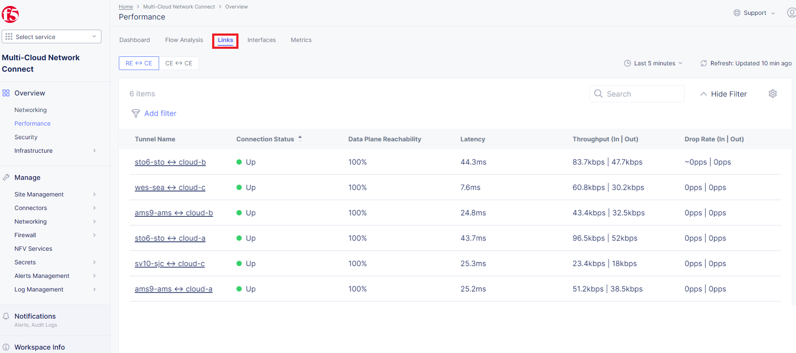

4. And finally, we will take a look at statistics by interface on each F5 Distributed Cloud Services node. Proceed to the **Interfaces** tab to see the site the interface refers to, its status and throughput, as well as drop rate.   

.. figure:: assets/monitoring_3.png

Destroy Environment
###################

When your done with the lab, make sure to run the destroy scripts to delete all resources in F5 Distributed Cloud and AWS.

.. code:: bash

     ./cloud-A-destroy.sh
     ./cloud-B-destroy.sh
     ./cloud-C-destroy.sh

Wrap-Up
#######

At this stage you should have set up a sample app environment used various multi-cloud networking features to securely network and control your app services. You also should be familiar with the telemetry and insights from the dashboards for the various MCN services. 

We hope you have a better understanding of the F5 Distributed Cloud MCN services and are now ready to implement it for your own organization. Should you have any issues or questions, please feel free to raise them via GitHub. Thank you!
