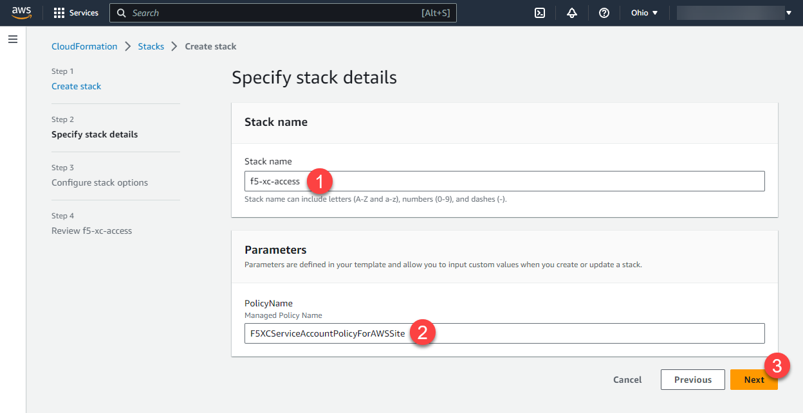

Create AWS Service Accounts
#########################

**Create stack using the cloud formation template for AWS VPC site.**
***************************************************************************

Sign into your AWS Account and type **CloudFormation** in the search bar. Then open the CloudFormation service.

.. figure:: ../../../assets/aws/aws_homepage.png

Click *Create stack*.

.. figure:: ../../../assets/aws/aws_create_stack.png

Upload cloudformation template located in the **./cloudformation/aws-vpc-site-service-account.yaml** and click **Next**.

.. figure:: ../../../assets/aws/aws_stack_upload.png

Fill required parameters and click **Next**.

- **STACK_NAME** - The name associated with the AWS Cloud Formation stack. For example: xc-cloud-access
- **Policy Name** - The name of the Service Account Policy. For example: F5XCServiceAccountPolicyForAWSSite
- **Password** - New user's password

Click **Next**.

.. figure:: ../../../assets/aws/aws_stack_next_1.png

Check acknowledge checkbox and click **Create stack**.

.. figure:: ../../../assets/aws/aws_stack_netx_2.png

In a few minutes navigate to the **Output** tab and find your **Access Key** and **Access Secret**.

.. figure:: ../../../assets/aws/aws_keys.png

The Access Key and the Secret Key can be used to create the **AWS Programmatic Access Credentials** on F5® Distributed Cloud Console. See `AWS Cloud Credentials <https://docs.cloud.f5.com/docs/how-to/site-management/cloud-credentials#aws-programmable-access-credentials>`_  for more information.

Open **./var.tf** and fill variables with your **Access Key** and **Access Secret**.

.. code:: bash

     variable "aws_access_key" {
          type = string
          default = "your_aws_access_key"
     }

     variable "aws_secret_key" {
          type = string
          default = "your_aws_access_secret"
     }

Open `Arcadia DNS Tool <https://tool.xc-mcn.securelab.online>`_ and copy your Zone Name.

.. figure:: ../../../assets/xc/zone_name.png

Set the **zone_name** variable in the **./var.tf** file.

.. code:: bash

     variable "zone_name" {
          type 	  = string
          default 	  = "your_zone_name"
          description = "Zone name"
     }

Find **api_url** variable and fill it with your F5 xC tenant name.

.. code:: bash

     variable "api_url" {
          type = string
          default = "https://your_tenant.console.ves.volterra.io/api"
     }

Sign in to the F5 Distributed Cloud Console and open **Administration** tab.

.. figure:: ../../../assets/xc/administration.png

Open **Credentials** section and click **Add Credentials**.

.. figure:: ../../../assets/xc/create_credentials.png

Fill the form as on the screen below and download your credentials file.

.. figure:: ../../../assets/xc/fill_credentials.png

Copy credentials file to the scripts folder and fix path for the **.p12** certificate in the **./var.tf** file.

.. code:: bash

     variable "api_p12_file" {
          default = "./path-to-api-cert.p12"
     }
     
Create **VES_P12_PASSWORD** environment variable with the password form the previous step.

.. code:: bash

     export VES_P12_PASSWORD=your_certificate_password

Initialize Terraform by running init command.

.. code:: bash

     terraform init

Apply Terraform script.

.. code:: bash

     terraform apply

Open F5 Distributed Cloud Console and navigate to the **Multi-Cloud Network Connect** tab.

.. figure:: ../../../assets/xc/cloud_a_sites.png

Open **Site List** and check the **Health Score**. It may take some time to provision the node.

.. figure:: ../../../assets/xc/cloud_a_ready.png
