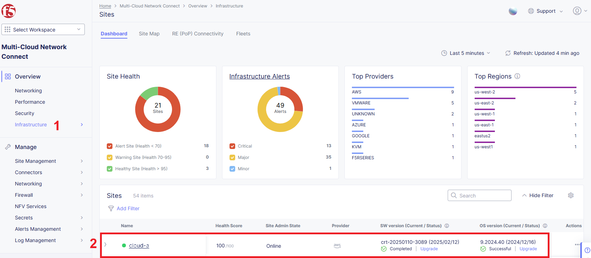

# Create Service Principal Using Cloud Reference Script

Perform the following steps to create a service principal using cloud reference script:

Run the Azure login command.

**Note**: The Azure CLI is required. See [Install the Azure CLI](https://docs.microsoft.com/en-us/cli/azure/install-azure-cli) for more information.

```bash
az login
```

The CLI opens your default browser and loads an Azure sign-in page. Sign in with your account credentials.

Or you can use Azure Cloud Shell. To run it, sign in to Azure portal and click on the "Cloud Shell" icon.


List the Azure accounts and subscriptions.

```bash
az account list --output table

Name                    CloudName    SubscriptionId                        TenantId                              State    IsDefault
----------------------  -----------  ------------------------------------  ------------------------------------  -------  -----------
Pay-As-You-Go Dev/Test  AzureCloud   subscription-id-xxx-xxxx-xxxxxxxxxx   tenant-id-xxx-xxxx-xxxx-xxxxxxxxxx    Enabled  True
```

Get the desired Azure **SubscriptionId** from the output of the above command.

Set the active account to the subscription ID as per your choice.

```bash
export SUBSCRIPTION_ID=<subscription_id>
az account set -s $SUBSCRIPTION_ID
```

Accept terms for the image:

```bash
az vm image terms accept --urn volterraedgeservices:entcloud_voltmesh_voltstack_node:freeplan_entcloud_voltmesh_voltstack_node_multinic:latest
```

Create the Azure custom role using the cloud reference script.

Download the script from the **./f5xc-azure-custom-role.json** location in the JSON format. Replace the value of **$SUBSCRIPTION_ID** with the relevant **SubscriptionId** in the JSON file.

```bash
"AssignableScopes": [
    "/subscriptions/$SUBSCRIPTION_ID"
],
```

If you use Cloud Shell, upload the updated script by clicking the **Upload/Download Files** button.


Enter the following command:

```bash
az role definition create --role-definition ./f5xc-azure-custom-role.json
```

Create the service principal and assign the custom role created.

The following is the list of field descriptions for the following command:

- **f5xc-azure-role** is the custom role created.
- **f5xc-azure-sp** is the service principal name that will be created.

```bash
az ad sp create-for-rbac --role="f5xc-azure-role" --scopes="/subscriptions/$SUBSCRIPTION_ID" --name "f5xc-azure-sp"

{
  "appId": "app-id-xxx-xxxx-xxxx-xxxxxxxxxxx",
  "displayName": "f5xc-azure-sp",
  "password": "password~xxxxxxxxxx.xxxxxxxxxxx",
  "tenant": "tenant-id-xxx-xxxx-xxxx-xxxxxxxxxx"
}
```

Open **./var.tf** and fill variables with your **Access Key** and **Access Secret**.

```bash
variable "azure_subscription_id" {
    type = string
    default = "your_subscription-id"
}

variable "azure_subscription_tenant_id" {
    type = string
    default = "your_tenant-id"
}

variable "azure_service_principal_appid" {
    type = string
    default = "your_service-principal-app-id"
}

variable "azure_service_principal_password" {
    type = string
    default = "your_service-principal-password"
}
```

Open [Arcadia DNS Tool](https://tool.xc-mcn.securelab.online) and copy your Zone Name.


Set the **zone_name** variable in the **./var.tf** file.

```bash
variable "zone_name" {
     type 	  = string
     default 	  = "your_zone_name"
     description = "Zone name"
}
```

Find the **api_url** variable and fill it with your F5 Distributed Cloud Platform tenant name.

```bash
variable "api_url" {
     type = string
     default = "https://your_tenant.console.ves.volterra.io/api"
}
```

Sign in to the F5 Distributed Cloud Console and open the **Administration** tab.


Open the **Credentials** section and click **Add Credentials**.


Fill the form as shown on the screen below and download your credentials file.


Copy the credentials file to the scripts folder and fix the path for the **.p12** certificate in the **./var.tf** file.

```bash
variable "api_p12_file" {
     default = "./path-to-api-cert.p12"
}
```

Create the **VES_P12_PASSWORD** environment variable with the password from the previous step.

```bash
export VES_P12_PASSWORD=your_certificate_password
```

Initialize Terraform by running the init command.

```bash
terraform init
```

Apply the Terraform script.

```bash
terraform apply
```

Open the F5 Distributed Cloud Console and navigate to the **Multi-Cloud Network Connect** tab.


Open **Infrastructure** => **Sites** and check the **Health Score**. It may take some time to provision the node.


