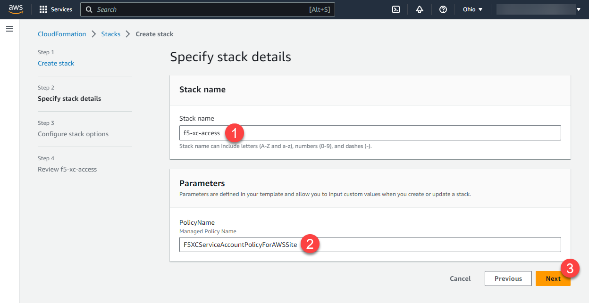
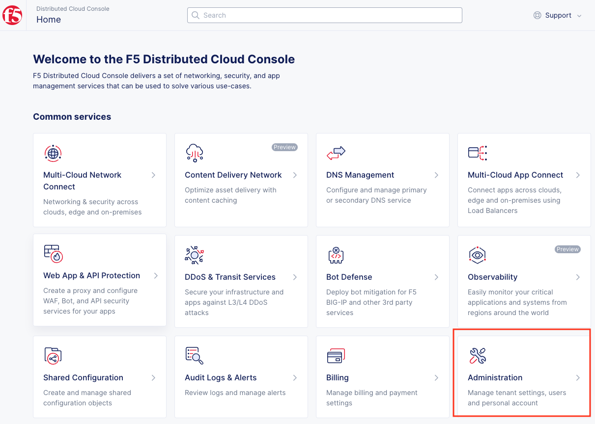

# Create AWS Service Accounts

## Create stack using the cloud formation template for AWS VPC site

Sign into your AWS Account and type **CloudFormation** in the search bar. Then open the CloudFormation service.


Click *Create stack*.


Upload cloudformation template located in the **./cloudformation/aws-vpc-site-service-account.yaml** and click **Next**.


Fill required parameters and click **Next**.

- **STACK_NAME** - The name associated with the AWS Cloud Formation stack. For example: xc-cloud-access
- **Policy Name** - The name of the Service Account Policy. For example: F5XCServiceAccountPolicyForAWSSite



Click **Next**.


Check acknowledge checkbox and click **Create stack**.


In a few minutes navigate to the **Output** tab and find your **Access Key** and **Access Secret**.


The Access Key and the Secret Key can be used to create the **AWS Programmatic Access Credentials** on F5® Distributed Cloud Console. See [AWS Cloud Credentials](https://docs.cloud.f5.com/docs/how-to/site-management/cloud-credentials#aws-programmable-access-credentials) for more information.

Open **./var.tf** and fill variables with your **Access Key** and **Access Secret**.

```bash
variable "aws_access_key" {
     type = string
     default = "your_aws_access_key"
}

variable "aws_secret_key" {
     type = string
     default = "your_aws_access_secret"
}
```

Find **api_url** variable and fill it with your F5 Distributed Cloud Platform tenant name.

```bash
variable "api_url" {
     type = string
     default = "https://your_tenant.console.ves.volterra.io/api"
}
```

Sign in to the F5 Distributed Cloud Console and open the **Administration** tab.



Open the **Credentials** section and click **Add Credentials**.


Fill the form as on the screen below and download your credentials file.


Copy credentials file to the scripts folder and fix path for the **.p12** certificate in the **./var.tf** file.

```bash
variable "api_p12_file" {
     default = "./path-to-api-cert.p12"
}
```

Create **VES_P12_PASSWORD** environment variable with the password from the previous step.

```bash
export VES_P12_PASSWORD=your_certificate_password
```

Initialize Terraform by running init command.

```bash
terraform init
```

Apply Terraform script.

```bash
terraform apply
```

Open F5 Distributed Cloud Console and navigate to the **Multi-Cloud Network Connect** tab.


Open **Infrastructure** => **Sites** and check the **Health Score**. It may take some time to provision the node.


