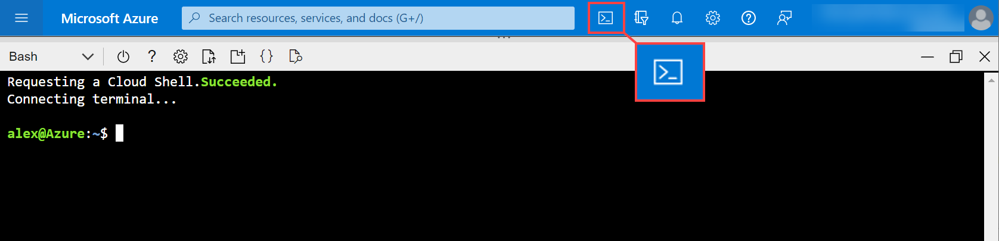
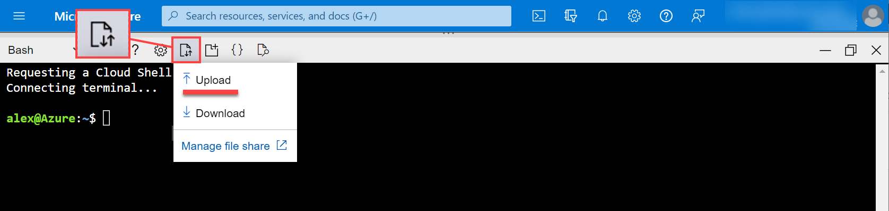

Create Service Principal Using Cloud Reference Script
#####################################################

Perform the following steps to create service principal using cloud reference script:

Run the Azure login command.

**Note**: The Azure CLI is required. See `Install the Azure CLI <https://docs.microsoft.com/en-us/cli/azure/install-azure-cli>`_ for more information.

.. code:: bash

    az login

The CLI opens your default browser and load an Azure sign-in page. Sign-in with your account credentials. 

Or you can use Azure Cloud Shell. Ti run it, sign in to Azure portal and click on the "Cloud Shell" icon.

List the Azure accounts and subscriptions.

.. code:: bash

    az account list --output table
    
    Name                    CloudName    SubscriptionId                        TenantId                              State    IsDefault
    ----------------------  -----------  ------------------------------------  ------------------------------------  -------  -----------
    Pay-As-You-Go Dev/Test  AzureCloud   subscription-id-xxx-xxxx-xxxxxxxxxx   tenant-id-xxx-xxxx-xxxx-xxxxxxxxxx    Enabled  True

Get the desired Azure **SubscriptionId** from the output of above command.

Set the active account to the subscription Id as per your choice.

.. code:: bash

    export SUBSCRIPTION_ID=<subscription_id>
    az account set -s $SUBSCRIPTION_ID

Accept terms for the image

.. code:: bash

    az vm image terms accept --urn volterraedgeservices:entcloud_voltmesh_voltstack_node:freeplan_entcloud_voltmesh_voltstack_node_multinic:latest    

Create the Azure custom role using the cloud reference script.

Download the script from the **./f5xc-azure-custom-role.json** location in the JSON format. 
Replace the value of **$SUBSCRIPTION_ID** to the relevant **SubscriptionId** in the JSON file. 

.. code:: bash

    "AssignableScopes": [
        "/subscriptions/$SUBSCRIPTION_ID"
    ],

If you use Cloud Shell upload updated script by clicking **Upload/Download Files** button.

Enter the following command:

.. code:: bash

    az role definition create --role-definition ./f5xc-azure-custom-role.json

Create the service principal and assign the custom role created.

The following is the list of field descriptions for the following command:

- **f5xc-azure-role** is the custom role created.

- **f5xc-azure-sp** is the service principal name that will be created.

.. code:: bash

    az ad sp create-for-rbac --role="f5xc-azure-role" --scopes="/subscriptions/$SUBSCRIPTION_ID" --name "f5xc-azure-sp"

    {
      "appId": "app-id-xxx-xxxx-xxxx-xxxxxxxxxxx",
      "displayName": "f5xc-azure-sp",
      "password": "password~xxxxxxxxxx.xxxxxxxxxxx",
      "tenant": "tenant-id-xxx-xxxx-xxxx-xxxxxxxxxx"
    }

Open **./var.tf** and fill variables with your **Access Key** and **Access Secret**.

.. code:: bash

    variable "azure_subscription_id" {
        type = string
        default = "your_subscription-id"
    }

    variable "azure_subscription_tenant_id" {
        type = string
        default = "your_tenant-id"
    }

    variable "azure_service_principal_appid" {
        type = string
        default = "your_service-principal-app-id"
    }

    variable "azure_service_principal_password" {
        type = string
        default = "your_service-principal-password"
    }

Find **api_url** variable and fill it with your F5 Distributed Cloud Platform tenant name.

.. code:: bash

     variable "api_url" {
          type = string
          default = "https://your_tenant.console.ves.volterra.io/api"
     }

Sign in to the F5 Distributed Cloud Console and open the **Administration** tab.

.. figure:: ../../../assets/xc/administration.png

Open the **Credentials** section and click **Add Credentials**.

.. figure:: ../../../assets/xc/create_credentials.png

Fill the form as on the screen below and download your credentials file.

.. figure:: ../../../assets/xc/fill_credentials.png

Copy credentials file to the scripts folder and fix path for the **.p12** certificate in the **./var.tf** file.

.. code:: bash

     variable "api_p12_file" {
          default = "./path-to-api-cert.p12"
     }
     
Create **VES_P12_PASSWORD** environment variable with the password from the previous step.

.. code:: bash

     export VES_P12_PASSWORD=your_certificate_password

Initialize Terraform by running init command.

.. code:: bash

     terraform init

Apply Terraform script.

.. code:: bash

     terraform apply

Open F5 Distributed Cloud Console and navigate to the **Multi-Cloud Network Connect** tab.

.. figure:: ../../../assets/xc/cloud_a_sites.png

Open **Infrastructure** => **Sites** and check the **Health Score**. It may take some time to provision the node.

.. figure:: ../../../assets/xc/cloud_b_ready.png
